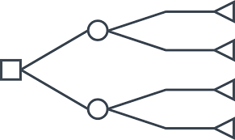

# Awesome Decision Tree Research Papers

   

  

A curated list of decision, classification and regression tree research papers with implementations from the following conferences:

- Machine learning
   * [NeurIPS](https://nips.cc/) 
   * [ICML](https://icml.cc/) 
   * [ICLR](https://iclr.cc/)
- Computer vision
   * [CVPR](http://cvpr2019.thecvf.com/)
   * [ICCV](http://iccv2019.thecvf.com/)
   * [ECCV](https://eccv2018.org/)
- Natural language processing
   * [ACL](http://www.acl2019.org/EN/index.xhtml)
   * [NAACL](https://naacl2019.org/)
   * [EMNLP](https://www.emnlp-ijcnlp2019.org/) 
- Data
   * [KDD](https://www.kdd.org/)
   * [CIKM](http://www.cikmconference.org/)   
   * [ICDM](http://icdm2019.bigke.org/)
   * [SDM](https://www.siam.org/Conferences/CM/Conference/sdm19)   
   * [PAKDD](http://pakdd2019.medmeeting.org)
   * [PKDD/ECML](http://ecmlpkdd2019.org)
   * [SIGIR](https://sigir.org/)
   * [WWW](https://www2019.thewebconf.org/)
   * [WSDM](www.wsdm-conference.org) 
- Artificial intelligence
   * [AAAI](https://www.aaai.org/)
   * [AISTATS](https://www.aistats.org/)
   * [ICANN](https://e-nns.org/icann2019/)   
   * [IJCAI](https://www.ijcai.org/)
   * [UAI](http://www.auai.org/)

Similar collections about [graph classification](https://github.com/benedekrozemberczki/awesome-graph-classification), [gradient boosting](https://github.com/benedekrozemberczki/awesome-gradient-boosting-papers), [fraud detection](https://github.com/benedekrozemberczki/awesome-fraud-detection-papers), [Monte Carlo tree search](https://github.com/benedekrozemberczki/awesome-monte-carlo-tree-search-papers), and [community detection](https://github.com/benedekrozemberczki/awesome-community-detection) papers with implementations.

## 2019

- **Multi-Level Deep Cascade Trees for Conversion Rate Prediction in Recommendation System (AAAI 2019)**
  - Hong Wen, Jing Zhang, Quan Lin, Keping Yang, Pipei Huang
  - [[Paper]](https://arxiv.org/pdf/1805.09484.pdf)
  
- **Induction of Non-Monotonic Logic Programs to Explain Boosted Tree Models Using LIME (AAAI 2019)**
  - Farhad Shakerin, Gopal Gupta
  - [[Paper]](https://arxiv.org/abs/1808.00629)
  
- **Learning Optimal and Fair Decision Trees for Non-Discriminative Decision-Making (AAAI 2019)**
  - Sina Aghaei, Mohammad Javad Azizi, Phebe Vayanos
  - [[Paper]](https://arxiv.org/abs/1903.10598)

- **Desiderata for Interpretability: Explaining Decision Tree Predictions with Counterfactuals (AAAI 2019)**
  - Kacper Sokol, Peter A. Flach
  - [[Paper]](https://aaai.org/ojs/index.php/AAAI/article/view/5154)
  
- **Weighted Oblique Decision Trees (AAAI 2019)**
  - Bin-Bin Yang, Song-Qing Shen, Wei Gao
  - [[Paper]](https://aaai.org/ojs/index.php/AAAI/article/view/4505)

- **Learning Optimal Classification Trees Using a Binary Linear Program Formulation (AAAI 2019)**
  - Sicco Verwer, Yingqian Zhang
  - [[Paper]](https://yingqianzhang.net/wp-content/uploads/2018/12/VerwerZhangAAAI-final.pdf)

- **Optimization of Hierarchical Regression Model with Application to Optimizing Multi-Response Regression K-ary Trees (AAAI 2019)**
  - Pooya Tavallali, Peyman Tavallali, Mukesh Singhal
  - [[Paper]](https://aaai.org/ojs/index.php/AAAI/article/view/4447/4325)

- **XBART: Accelerated Bayesian Additive Regression Trees (AISTATS 2019)**
  - Jingyu He, Saar Yalov, P. Richard Hahn
  - [[Paper]](https://arxiv.org/abs/1810.02215)

- **Interaction Detection with Bayesian Decision Tree Ensembles (AISTATS 2019)**
  - Junliang Du, Antonio R. Linero
  - [[Paper]](https://arxiv.org/abs/1809.08524)
  
- **Adversarial Training of Gradient-Boosted Decision Trees (CIKM 2019)**
  - Stefano Calzavara, Claudio Lucchese, Gabriele Tolomei
  - [[Paper]](https://www.dais.unive.it/~calzavara/papers/cikm19.pdf)

- **Interpretable MTL from Heterogeneous Domains using Boosted Tree (CIKM 2019)**
  - Ya-Lin Zhang, Longfei Li
  - [[Paper]](https://dl.acm.org/citation.cfm?id=3357384.3358072)

- **Interpreting CNNs via Decision Trees (CVPR 2019)**
  - Quanshi Zhang, Yu Yang, Haotian Ma, Ying Nian Wu
  - [[Paper]](https://arxiv.org/abs/1802.00121)
  
- **Incorporating Grouping Information into Bayesian Decision Tree Ensembles (ICML 2019)**
  - Junliang Du, Antonio R. Linero
  - [[Paper]](http://proceedings.mlr.press/v97/du19d.html)

- **Adaptive Neural Trees (ICML 2019)**
  - Ryutaro Tanno, Kai Arulkumaran, Daniel C. Alexander, Antonio Criminisi, Aditya V. Nori
  - [[Paper]](https://arxiv.org/abs/1807.06699)
  - [[Code]](https://github.com/rtanno21609/AdaptiveNeuralTrees)

- **Robust Decision Trees Against Adversarial Examples (ICML 2019)**
  - Hongge Chen, Huan Zhang, Duane S. Boning, Cho-Jui Hsieh
  - [[Paper]](https://arxiv.org/abs/1902.10660)
  - [[Code]](https://github.com/chenhongge/RobustTrees)
  
- **Learn Smart with Less: Building Better Online Decision Trees with Fewer Training Examples (IJCAI 2019)**
  - Ariyam Das, Jin Wang, Sahil M. Gandhi, Jae Lee, Wei Wang, Carlo Zaniolo
  - [[Paper]](https://www.ijcai.org/proceedings/2019/0306.pdf)
  
- **FAHT: An Adaptive Fairness-aware Decision Tree Classifier (IJCAI 2019)**
  - Wenbin Zhang, Eirini Ntoutsi
  - [[Paper]](https://arxiv.org/abs/1907.07237)
  - [[Code]](https://github.com/vanbanTruong/FAHT)

- **Inter-node Hellinger Distance based Decision Tree (IJCAI 2019)**
  - Pritom Saha Akash, Md. Eusha Kadir, Amin Ahsan Ali, Mohammad Shoyaib
  - [[Paper]](https://www.ijcai.org/proceedings/2019/0272.pdf)
  - [[Matlab Code]](https://github.com/ZDanielsResearch/HellingerTreesMatlab)
  - [[R Code]](https://github.com/kaustubhrpatil/HDDT)

- **Gradient Boosting with Piece-Wise Linear Regression Trees (IJCAI 2019)**
  - Yu Shi, Jian Li, Zhize Li
  - [[Paper]](https://arxiv.org/abs/1802.05640)
  - [[Code]](https://github.com/GBDT-PL/GBDT-PL)

- **A Gradient-Based Split Criterion for Highly Accurate and Transparent Model Trees (IJCAI 2019)**
  - Klaus Broelemann, Gjergji Kasneci
  - [[Paper]](https://arxiv.org/abs/1809.09703)
  
- **Combining Decision Trees and Neural Networks for Learning-to-Rank in Personal Search (KDD 2019)**
  - Pan Li, Zhen Qin, Xuanhui Wang, Donald Metzler
  - [[Paper]](https://ai.google/research/pubs/pub48133/)
  
- **Provably Robust Boosted Decision Stumps and Trees against Adversarial Attacks (NeurIPS 2019)**
  - Maksym Andriushchenko, Matthias Hein
  - [[Paper]](https://arxiv.org/abs/1906.03526)
  - [[Code]](https://github.com/max-andr/provably-robust-boosting)

- **Optimal Decision Tree with Noisy Outcomes (NeurIPS 2019)**
  - Su Jia, Viswanath Nagarajan, Fatemeh Navidi, R. Ravi
  - [[Paper]](https://papers.nips.cc/paper/8592-optimal-decision-tree-with-noisy-outcomes.pdf)
  - [[Code]](https://github.com/sjia1/ODT-with-noisy-outcomes)

- **Regularized Gradient Boosting (NeurIPS 2019)**
  - Corinna Cortes, Mehryar Mohri, Dmitry Storcheus
  - [[Paper]](https://papers.nips.cc/paper/8784-regularized-gradient-boosting.pdf)

- **Optimal Sparse Decision Trees (NeurIPS 2019)**
  - Xiyang Hu, Cynthia Rudin, Margo Seltzer
  - [[Paper]](https://papers.nips.cc/paper/8947-optimal-sparse-decision-trees.pdf)
  - [[Code]](https://github.com/xiyanghu/OSDT)

- **Calibrating Probability Estimation Trees using Venn-Abers Predictors (SDM 2019)**
  - Ulf Johansson, Tuwe Löfström, Henrik Boström
  - [[Paper]](https://epubs.siam.org/doi/pdf/10.1137/1.9781611975673.4)
  
- **Fast Training for Large-Scale One-versus-All Linear Classifiers using Tree-Structured Initialization (SDM 2019)**
  - Huang Fang, Minhao Cheng, Cho-Jui Hsieh, Michael P. Friedlander
  - [[Paper]](https://epubs.siam.org/doi/pdf/10.1137/1.9781611975673.32)
  
- **Block-distributed Gradient Boosted Trees (SIGIR 2019)**
  - Theodore Vasiloudis, Hyunsu Cho, Henrik Boström
  - [[Paper]](https://arxiv.org/abs/1904.10522)
  
- **Entity Personalized Talent Search Models with Tree Interaction Features (WWW 2019)**
  - Cagri Ozcaglar, Sahin Cem Geyik, Brian Schmitz, Prakhar Sharma, Alex Shelkovnykov, Yiming Ma, Erik Buchanan
  - [[Paper]](https://arxiv.org/abs/1902.09041)

## 2018
- **Adapting to Concept Drift in Credit Card Transaction Data Streams Using Contextual Bandits and Decision Trees (AAAI 2018)**
  - Dennis J. N. J. Soemers, Tim Brys, Kurt Driessens, Mark H. M. Winands, Ann Nowé
  - [[Paper]](https://www.aaai.org/ocs/index.php/AAAI/AAAI18/paper/viewFile/16183/16394)

- **MERCS: Multi-Directional Ensembles of Regression and Classification Trees (AAAI 2018)**
  - Elia Van Wolputte, Evgeniya Korneva, Hendrik Blockeel
  - [[Paper]](https://www.aaai.org/ocs/index.php/AAAI/AAAI18/paper/viewFile/16875/16735)
  - [[Code]](https://github.com/eliavw/mercs-v5)

- **Differential Performance Debugging With Discriminant Regression Trees (AAAI 2018)**
  - Saeid Tizpaz-Niari, Pavol Cerný, Bor-Yuh Evan Chang, Ashutosh Trivedi
  - [[Paper]](https://arxiv.org/abs/1711.04076)
  - [[Code]](https://github.com/cuplv/DPDEBUGGER)

- **Estimating the Class Prior in Positive and Unlabeled Data Through Decision Tree Induction (AAAI 2018)**
  - Jessa Bekker, Jesse Davis
  - [[Paper]](https://aaai.org/ocs/index.php/AAAI/AAAI18/paper/view/16776)

- **MDP-Based Cost Sensitive Classification Using Decision Trees (AAAI 2018)**
  - Shlomi Maliah, Guy Shani
  - [[Paper]](https://aaai.org/ocs/index.php/AAAI/AAAI18/paper/view/17128)

- **Generative Adversarial Image Synthesis With Decision Tree Latent Controller (CVPR 2018)**
  - Takuhiro Kaneko, Kaoru Hiramatsu, Kunio Kashino
  - [[Paper]](https://arxiv.org/abs/1805.10603)
  - [[Code]](https://github.com/LynnHo/DTLC-GAN-Tensorflow)

- **Enhancing Very Fast Decision Trees with Local Split-Time Predictions (ICDM 2018)**
  - Viktor Losing, Heiko Wersing, Barbara Hammer
  - [[Paper]](https://www.techfak.uni-bielefeld.de/~hwersing/LosingHammerWersing_ICDM2018.pdf)
  - [[Code]](https://github.com/ICDM2018Submission/VFDT-split-time-prediction)
  
- **Realization of Random Forest for Real-Time Evaluation through Tree Framing (ICDM 2018)**
  - Sebastian Buschjäger, Kuan-Hsun Chen, Jian-Jia Chen, Katharina Morik
  - [[Paper]](https://sfb876.tu-dortmund.de/PublicPublicationFiles/buschjaeger_2018a.pdf)

- **Finding Influential Training Samples for Gradient Boosted Decision Trees (ICML 2018)**
  - Boris Sharchilev, Yury Ustinovskiy, Pavel Serdyukov, Maarten de Rijke
  - [[Paper]](https://arxiv.org/abs/1802.06640)
  - [[Code]](https://github.com/bsharchilev/influence_boosting)

- **Learning Optimal Decision Trees with SAT (IJCAI 2018)**
  - Nina Narodytska, Alexey Ignatiev, Filipe Pereira, João Marques-Silva
  - [[Paper]](https://www.ijcai.org/proceedings/2018/0189.pdf)

- **Extremely Fast Decision Tree (KDD 2018)**
  - Chaitanya Manapragada, Geoffrey I. Webb, Mahsa Salehi
  - [[Paper]](https://arxiv.org/abs/1802.08780)
  - [[Code]](https://github.com/doubleplusplus/incremental_decision_tree-CART-Random_Forest_python)
  
- **RapidScorer: Fast Tree Ensemble Evaluation by Maximizing Compactness in Data Level Parallelization (KDD 2018)**
  - Ting Ye, Hucheng Zhou, Will Y. Zou, Bin Gao, Ruofei Zhang
  - [[Paper]](http://ai.stanford.edu/~wzou/kdd_rapidscorer.pdf)
  
- **CatBoost: Unbiased Boosting with Categorical Features (NIPS 2018)**
  - Liudmila Prokhorenkova, Gleb Gusev, Aleksandr Vorobev, Anna Veronika Dorogush, Andrey Gulin
  - [[Paper]](https://papers.nips.cc/paper/7898-catboost-unbiased-boosting-with-categorical-features.pdf)
  - [[Code]](https://catboost.ai/)
  
- **Active Learning for Non-Parametric Regression Using Purely Random Trees (NIPS 2018)**
  - Jack Goetz, Ambuj Tewari, Paul Zimmerman
  - [[Paper]](https://papers.nips.cc/paper/7520-active-learning-for-non-parametric-regression-using-purely-random-trees.pdf)

- **Alternating Optimization of Decision Trees with Application to Learning Sparse Oblique Trees (NIPS 2018)**
  - Miguel Á. Carreira-Perpiñán, Pooya Tavallali
  - [[Paper]](https://papers.nips.cc/paper/7397-alternating-optimization-of-decision-trees-with-application-to-learning-sparse-oblique-trees)

- **Multi-Layered Gradient Boosting Decision Trees (NIPS 2018)**
  - Ji Feng, Yang Yu, Zhi-Hua Zhou
  - [[Paper]](https://papers.nips.cc/paper/7614-multi-layered-gradient-boosting-decision-trees.pdf)
  - [[Code]](https://github.com/kingfengji/mGBDT)
  
- **Transparent Tree Ensembles (SIGIR 2018)**
  - Alexander Moore, Vanessa Murdock, Yaxiong Cai, Kristine Jones
  - [[Paper]](http://delivery.acm.org/10.1145/3220000/3210151/p1241-moore.pdf?ip=129.215.164.203&id=3210151&acc=ACTIVE%20SERVICE&key=C2D842D97AC95F7A%2EEB9E991028F4E1F1%2E4D4702B0C3E38B35%2E4D4702B0C3E38B35&__acm__=1559054892_a29816c683aa83a0ce0fbb777c68daba)

- **Privacy-aware Ranking with Tree Ensembles on the Cloud (SIGIR 2018)**
  - Shiyu Ji, Jinjin Shao, Daniel Agun, Tao Yang
  - [[Paper]](https://sites.cs.ucsb.edu/projects/ds/sigir18.pdf)

## 2017
- **Strategic Sequences of Arguments for Persuasion Using Decision Trees (AAAI 2017)**
  - Emmanuel Hadoux, Anthony Hunter
  - [[Paper]](http://www0.cs.ucl.ac.uk/staff/a.hunter/papers/aaai17.pdf)

- **BoostVHT: Boosting Distributed Streaming Decision Trees (CIKM 2017)**
  - Theodore Vasiloudis, Foteini Beligianni, Gianmarco De Francisci Morales
  - [[Paper]](https://melmeric.files.wordpress.com/2010/05/boostvht-boosting-distributed-streaming-decision-trees.pdf)

- **Latency Reduction via Decision Tree Based Query Construction (CIKM 2017)**
  - Aman Grover, Dhruv Arya, Ganesh Venkataraman
  - [[Paper]](https://dl.acm.org/citation.cfm?id=3132865)

- **Enumerating Distinct Decision Trees (ICML 2017)**
  - Salvatore Ruggieri
  - [[Paper]](http://proceedings.mlr.press/v70/ruggieri17a/ruggieri17a.pdf)

- **Gradient Boosted Decision Trees for High Dimensional Sparse Output (ICML 2017)**
  - Si Si, Huan Zhang, S. Sathiya Keerthi, Dhruv Mahajan, Inderjit S. Dhillon, Cho-Jui Hsieh
  - [[Paper]](http://proceedings.mlr.press/v70/si17a.html)
  - [[Code]](https://github.com/springdaisy/GBDT)

- **Extremely Fast Decision Tree Mining for Evolving Data Streams (KDD 2017)**
  - Albert Bifet, Jiajin Zhang, Wei Fan, Cheng He, Jianfeng Zhang, Jianfeng Qian, Geoff Holmes, Bernhard Pfahringer
  - [[Paper]](https://core.ac.uk/download/pdf/151040580.pdf)
  
- **CatBoost: Gradient Boosting with Categorical Features Support (NIPS 2017)**
  - Anna Veronika Dorogush, Vasily Ershov, Andrey Gulin
  - [[Paper]](https://arxiv.org/abs/1810.11363)
  - [[Code]](https://catboost.ai/)

- **LightGBM: A Highly Efficient Gradient Boosting Decision Tree (NIPS 2017)**
  - Guolin Ke, Qi Meng, Thomas Finley, Taifeng Wang, Wei Chen, Weidong Ma, Qiwei Ye, Tie-Yan Liu
  - [[Paper]](https://papers.nips.cc/paper/6907-lightgbm-a-highly-efficient-gradient-boosting-decision-tree)
  - [[Code]](https://lightgbm.readthedocs.io/en/latest/)

- **Variable Importance Using Decision Trees (NIPS 2017)**
  - Jalil Kazemitabar, Arash Amini, Adam Bloniarz, Ameet S. Talwalkar
  - [[Paper]](https://papers.nips.cc/paper/6646-variable-importance-using-decision-trees)
  
- **Pruning Decision Trees via Max-Heap Projection (SDM 2017)**
  - Zhi Nie, Binbin Lin, Shuai Huang, Naren Ramakrishnan, Wei Fan, Jieping Ye
  - [[Paper]](https://www.researchgate.net/publication/317485748_Pruning_Decision_Trees_via_Max-Heap_Projection)

- **A Practical Method for Solving Contextual Bandit Problems Using Decision Trees (UAI 2017)**
  - Adam N. Elmachtoub, Ryan McNellis, Sechan Oh, Marek Petrik
  - [[Paper]](https://arxiv.org/abs/1706.04687)

- **Complexity of Solving Decision Trees with Skew-Symmetric Bilinear Utility (UAI 2017)**
  - Hugo Gilbert, Olivier Spanjaard
  - [[Paper]](http://auai.org/uai2017/proceedings/papers/64.pdf)
  
- **GB-CENT: Gradient Boosted Categorical Embedding and Numerical Trees (WWW 2017)**
  - Qian Zhao, Yue Shi, Liangjie Hong
  - [[Paper]](http://papers.www2017.com.au.s3-website-ap-southeast-2.amazonaws.com/proceedings/p1311.pdf)

## 2016
- **Sparse Perceptron Decision Tree for Millions of Dimensions (AAAI 2016)**
  - Weiwei Liu, Ivor W. Tsang
  - [[Paper]](https://aaai.org/ocs/index.php/AAAI/AAAI16/paper/view/12111)

- **Learning Online Smooth Predictors for Realtime Camera Planning Using Recurrent Decision Trees (CVPR 2016)**
  - Jianhui Chen, Hoang Minh Le, Peter Carr, Yisong Yue, James J. Little
  - [[Paper]](http://hoangle.info/papers/cvpr2016_online_smooth_long.pdf)

- **Online Learning with Bayesian Classification Trees (CVPR 2016)**
  - Samuel Rota Bulò, Peter Kontschieder
  - [[Paper]](http://www.dsi.unive.it/~srotabul/files/publications/CVPR2016.pdf)

- **Accurate Robust and Efficient Error Estimation for Decision Trees (ICML 2016)**
  - Lixin Fan
  - [[Paper]](http://proceedings.mlr.press/v48/fan16.pdf)

- **Meta-Gradient Boosted Decision Tree Model for Weight and Target Learning (ICML 2016)**
  - Yury Ustinovskiy, Valentina Fedorova, Gleb Gusev, Pavel Serdyukov
  - [[Paper]](http://proceedings.mlr.press/v48/ustinovskiy16.html)

- **Boosted Decision Tree Regression Adjustment for Variance Reduction in Online Controlled Experiments (KDD 2016)**
  - Alexey Poyarkov, Alexey Drutsa, Andrey Khalyavin, Gleb Gusev, Pavel Serdyukov
  - [[Paper]](https://www.kdd.org/kdd2016/papers/files/adf0653-poyarkovA.pdf)
  
- **XGBoost: A Scalable Tree Boosting System (KDD 2016)**
  - Tianqi Chen, Carlos Guestrin
  - [[Paper]](https://www.kdd.org/kdd2016/papers/files/rfp0697-chenAemb.pdf)
  - [[Code]](https://xgboost.readthedocs.io/en/latest/)

- **Yggdrasil: An Optimized System for Training Deep Decision Trees at Scale (NIPS 2016)**
  - Firas Abuzaid, Joseph K. Bradley, Feynman T. Liang, Andrew Feng, Lee Yang, Matei Zaharia, Ameet S. Talwalkar
  - [[Paper]](https://papers.nips.cc/paper/6366-yggdrasil-an-optimized-system-for-training-deep-decision-trees-at-scale)

- **A Communication-Efficient Parallel Algorithm for Decision Tree (NIPS 2016)**
  - Qi Meng, Guolin Ke, Taifeng Wang, Wei Chen, Qiwei Ye, Zhiming Ma, Tie-Yan Liu
  - [[Paper]](https://arxiv.org/abs/1611.01276)
  - [[Code]](https://github.com/microsoft/LightGBM/blob/master/docs/Features.rst)

- **Exploiting CPU SIMD Extensions to Speed-up Document Scoring with Tree Ensembles (SIGIR 2016)**
  - Claudio Lucchese, Franco Maria Nardini, Salvatore Orlando, Raffaele Perego, Nicola Tonellotto, Rossano Venturini
  - [[Paper]](http://pages.di.unipi.it/rossano/wp-content/uploads/sites/7/2016/07/SIGIR16a.pdf)
  - [[Code]](https://github.com/hpclab/vectorized-quickscorer)

- **Post-Learning Optimization of Tree Ensembles for Efficient Ranking (SIGIR 2016)**
  - Claudio Lucchese, Franco Maria Nardini, Salvatore Orlando, Raffaele Perego, Fabrizio Silvestri, Salvatore Trani
  - [[Paper]](https://www.researchgate.net/publication/305081572_Post-Learning_Optimization_of_Tree_Ensembles_for_Efficient_Ranking)
  - [[Code]](https://github.com/hpclab/quickrank)

## 2015
- **Particle Gibbs for Bayesian Additive Regression Trees (AISTATS 2015)**
  - Balaji Lakshminarayanan, Daniel M. Roy, Yee Whye Teh
  - [[Paper]](https://arxiv.org/abs/1502.04622)

- **DART: Dropouts Meet Multiple Additive Regression Trees (AISTATS 2015)**
  - Korlakai Vinayak Rashmi, Ran Gilad-Bachrach
  - [[Paper]](https://arxiv.org/abs/1505.01866)
  - [[Code]](https://xgboost.readthedocs.io/en/latest/)

- **Single Target Tracking Using Adaptive Clustered Decision Trees and Dynamic Multi-level Appearance Models (CVPR 2015)**
  - Jingjing Xiao, Rustam Stolkin, Ales Leonardis
  - [[Paper]](https://www.cv-foundation.org/openaccess/content_cvpr_2015/app/3B_058.pdf)

- **Face Alignment Using Cascade Gaussian Process Regression Trees (CVPR 2015)**
  - Donghoon Lee, Hyunsin Park, Chang Dong Yoo
  - [[Paper]](https://slsp.kaist.ac.kr/paperdata/Face_Alignment_Using.pdf)
  - [[Code]](https://github.com/donghoonlee04/cGPRT)

- **Tracking-by-Segmentation with Online Gradient Boosting Decision Tree (ICCV 2015)**
  - Jeany Son, Ilchae Jung, Kayoung Park, Bohyung Han
  - [[Paper]](Tracking-by-Segmentation with Online Gradient Boosting Decision Tree)

- **Entropy Evaluation Based on Confidence Intervals of Frequency Estimates : Application to the Learning of Decision Trees (ICML 2015)**
  - Mathieu Serrurier, Henri Prade
  - [[Paper]](http://proceedings.mlr.press/v37/serrurier15.pdf)
  
- **Large-scale Distributed Dependent Nonparametric Trees (ICML 2015)**
  - Zhiting Hu, Qirong Ho, Avinava Dubey, Eric P. Xing
  - [[Paper]](https://www.cs.cmu.edu/~zhitingh/data/icml15hu.pdf)

- **Optimal Action Extraction for Random Forests and Boosted Trees (KDD 2015)**
  - Zhicheng Cui, Wenlin Chen, Yujie He, Yixin Chen
  - [[Paper]](https://www.cse.wustl.edu/~ychen/public/OAE.pdf)

- **A Decision Tree Framework for Spatiotemporal Sequence Prediction (KDD 2015)**
  - Taehwan Kim, Yisong Yue, Sarah L. Taylor, Iain A. Matthews
  - [[Paper]](http://www.yisongyue.com/publications/kdd2015_ssw_dt.pdf)

- **Efficient Non-greedy Optimization of Decision Trees (NIPS 2015)**
  - Mohammad Norouzi, Maxwell D. Collins, Matthew Johnson, David J. Fleet, Pushmeet Kohli
  - [[Paper]](https://arxiv.org/abs/1511.04056)
  
- **QuickScorer: A Fast Algorithm to Rank Documents with Additive Ensembles of Regression Trees (SIGIR 2015)**
  - Claudio Lucchese, Franco Maria Nardini, Salvatore Orlando, Raffaele Perego, Nicola Tonellotto, Rossano Venturini
  - [[Paper]](http://pages.di.unipi.it/rossano/wp-content/uploads/sites/7/2015/11/sigir15.pdf)
  - [[Code]](https://github.com/hpclab/quickrank)

## 2014

- **A Mixtures-of-Trees Framework for Multi-Label Classification (CIKM 2014)**
  - Charmgil Hong, Iyad Batal, Milos Hauskrecht
  - [[Paper]](https://www.ncbi.nlm.nih.gov/pmc/articles/PMC4410801/)
  
- **On Building Decision Trees from Large-scale Data in Applications of On-line Advertising (CIKM 2014)**
  - Shivaram Kalyanakrishnan, Deepthi Singh, Ravi Kant
  - [[Paper]](https://www.cse.iitb.ac.in/~shivaram/papers/ksk_cikm_2014.pdf)

- **Fast Supervised Hashing with Decision Trees for High-Dimensional Data (CVPR 2014)**
  - Guosheng Lin, Chunhua Shen, Qinfeng Shi, Anton van den Hengel, David Suter
  - [[Paper]](https://arxiv.org/abs/1404.1561)

- **One Millisecond Face Alignment with an Ensemble of Regression Trees (CVPR 2014)**
  - Vahid Kazemi, Josephine Sullivan
  - [[Paper]](https://www.researchgate.net/publication/264419855_One_Millisecond_Face_Alignment_with_an_Ensemble_of_Regression_Trees)
  
- **The return of AdaBoost.MH: multi-class Hamming trees (ICLR 2014)**
  - Balázs Kégl
  - [[Paper]](https://arxiv.org/pdf/1312.6086.pdf)

- **Diagnosis Determination: Decision Trees Optimizing Simultaneously Worst and Expected Testing Cost (ICML 2014)**
  - Ferdinando Cicalese, Eduardo Sany Laber, Aline Medeiros Saettler
  - [[Paper]](https://pdfs.semanticscholar.org/47ae/852f83b76f95b27ab00308d04f6020bdf71f.pdf)
  
- **Learning Multiple-Question Decision Trees for Cold-Start Recommendation (WSDM 2013)**
  - Mingxuan Sun, Fuxin Li, Joonseok Lee, Ke Zhou, Guy Lebanon, Hongyuan Zha
  - [[Paper]](http://www.joonseok.net/papers/coldstart.pdf)

## 2013
- **Weakly Supervised Learning of Image Partitioning Using Decision Trees with Structured Split Criteria (ICCV 2013)**
  - Christoph N. Straehle, Ullrich Köthe, Fred A. Hamprecht
  - [[Paper]](https://ieeexplore.ieee.org/document/6751340)

- **Revisiting Example Dependent Cost-Sensitive Learning with Decision Trees (ICCV 2013)**
  - Oisin Mac Aodha, Gabriel J. Brostow
  - [[Paper]](https://ieeexplore.ieee.org/document/6751133)

- **Conformal Prediction Using Decision Trees (ICDM 2013)**
  - Ulf Johansson, Henrik Boström, Tuve Löfström
  - [[Paper]](https://ieeexplore.ieee.org/abstract/document/6729517)

- **Focal-Test-Based Spatial Decision Tree Learning: A Summary of Results (ICDM 2013)**
  - Zhe Jiang, Shashi Shekhar, Xun Zhou, Joseph K. Knight, Jennifer Corcoran
  - [[Paper]](https://pdfs.semanticscholar.org/f28e/df8d9eed76e4ce97cb6bd4182d590547be5e.pdf)

- **Top-down Particle Filtering for Bayesian Decision Trees (ICML 2013)**
  - Balaji Lakshminarayanan, Daniel M. Roy, Yee Whye Teh
  - [[Paper]](https://arxiv.org/abs/1303.0561)

- **Quickly Boosting Decision Trees - Pruning Underachieving Features Early (ICML 2013)**
  - Ron Appel, Thomas J. Fuchs, Piotr Dollár, Pietro Perona
  - [[Paper]](http://proceedings.mlr.press/v28/appel13.pdf)

- **Knowledge Compilation for Model Counting: Affine Decision Trees (IJCAI 2013)**
  - Frédéric Koriche, Jean-Marie Lagniez, Pierre Marquis, Samuel Thomas
  - [[Paper]](https://www.researchgate.net/publication/262398921_Knowledge_Compilation_for_Model_Counting_Affine_Decision_Trees)
  
- **Understanding Variable Importances in Forests of Randomized Trees (NIPS 2013)**
  - Gilles Louppe, Louis Wehenkel, Antonio Sutera, Pierre Geurts
  - [[Paper]](https://papers.nips.cc/paper/4928-understanding-variable-importances-in-forests-of-randomized-trees)

- **Regression-tree Tuning in a Streaming Setting (NIPS 2013)**
  - Samory Kpotufe, Francesco Orabona
  - [[Paper]](https://papers.nips.cc/paper/4898-regression-tree-tuning-in-a-streaming-setting)

- **Learning Max-Margin Tree Predictors (UAI 2013)**
  - Ofer Meshi, Elad Eban, Gal Elidan, Amir Globerson
  - [[Paper]](https://ttic.uchicago.edu/~meshi/papers/mtreen.pdf)

## 2012
- **Regression Tree Fields - An Efficient, Non-parametric Approach to Image Labeling Problems (CVPR 2012)**
  - Jeremy Jancsary, Sebastian Nowozin, Toby Sharp, Carsten Rother
  - [[Paper]](http://www.nowozin.net/sebastian/papers/jancsary2012rtf.pdf)

- **ConfDTree: Improving Decision Trees Using Confidence Intervals (ICDM 2012)**
  - Gilad Katz, Asaf Shabtai, Lior Rokach, Nir Ofek
  - [[Paper]](https://ieeexplore.ieee.org/document/6413889)

- **Improved Information Gain Estimates for Decision Tree Induction (ICML 2012)**
  - Sebastian Nowozin
  - [[Paper]](https://arxiv.org/abs/1206.4620)

- **Learning Partially Observable Models Using Temporally Abstract Decision Trees (NIPS 2012)**
  - Erik Talvitie
  - [[Paper]](https://papers.nips.cc/paper/4662-learning-partially-observable-models-using-temporally-abstract-decision-trees)
  
- **Subtree Replacement in Decision Tree Simplification (SDM 2012)**
  - Salvatore Ruggieri
  - [[Paper]](http://pages.di.unipi.it/ruggieri/Papers/sdm2012.pdf)

## 2011
- **Incorporating Boosted Regression Trees into Ecological Latent Variable Models (AAAI 2011)**
  - Rebecca A. Hutchinson, Li-Ping Liu, Thomas G. Dietterich
  - [[Paper]](https://www.aaai.org/ocs/index.php/AAAI/AAAI11/paper/viewFile/3711/4086)

- **Syntactic Decision Tree LMs: Random Selection or Intelligent Design (EMNLP 2011)**
  - Denis Filimonov, Mary P. Harper
  - [[Paper]](https://www.aclweb.org/anthology/D11-1064)
  
- **Decision Tree Fields (ICCV 2011)**
  - Sebastian Nowozin, Carsten Rother, Shai Bagon, Toby Sharp, Bangpeng Yao, Pushmeet Kohli
  - [[Paper]](https://www.microsoft.com/en-us/research/wp-content/uploads/2016/11/nrbsyk_iccv11.pdf)

- **Confidence in Predictions from Random Tree Ensembles (ICDM 2011)**
  - Siddhartha Bhattacharyya
  - [[Paper]](https://link.springer.com/article/10.1007/s10115-012-0600-z)

- **Speeding-Up Hoeffding-Based Regression Trees With Options (ICML 2011)**
  - Elena Ikonomovska, João Gama, Bernard Zenko, Saso Dzeroski
  - [[Paper]](https://icml.cc/Conferences/2011/papers/349_icmlpaper.pdf)
  
- **Density Estimation Trees (KDD 2011)**
  - Parikshit Ram, Alexander G. Gray
  - [[Paper]](https://mlpack.org/papers/det.pdf)
  
- **Bagging Gradient-Boosted Trees for High Precision, Low Variance Ranking Models (SIGIR 2011)**
  - Yasser Ganjisaffar, Rich Caruana, Cristina Videira Lopes
  - [[Paper]](http://www.ccs.neu.edu/home/vip/teach/MLcourse/4_boosting/materials/bagging_lmbamart_jforests.pdf)

- **On the Complexity of Decision Making in Possibilistic Decision Trees (UAI 2011)**
  - Hélène Fargier, Nahla Ben Amor, Wided Guezguez
  - [[Paper]](https://dslpitt.org/uai/papers/11/p203-fargier.pdf)

- **Adaptive Bootstrapping of Recommender Systems Using Decision Trees (WSDM 2011)**
  - Nadav Golbandi, Yehuda Koren, Ronny Lempel
  - [[Paper]](https://dl.acm.org/citation.cfm?id=1935910)

- **Parallel Boosted Regression Trees for Web Search Ranking (WWW 2011)**
  - Stephen Tyree, Kilian Q. Weinberger, Kunal Agrawal, Jennifer Paykin
  - [[Paper]](http://www.cs.cornell.edu/~kilian/papers/fr819-tyreeA.pdf)

## 2010
- **Discrimination Aware Decision Tree Learning (ICDM 2010)**
  - Faisal Kamiran, Toon Calders, Mykola Pechenizkiy
  - [[Paper]](https://www.win.tue.nl/~mpechen/publications/pubs/KamiranICDM2010.pdf)

- **Decision Trees for Uplift Modeling (ICDM 2010)**
  - Piotr Rzepakowski, Szymon Jaroszewicz
  - [[Paper]](https://core.ac.uk/download/pdf/81899141.pdf)

- **Learning Markov Network Structure with Decision Trees (ICDM 2010)**
  - Daniel Lowd, Jesse Davis
  - [[Paper]](https://ix.cs.uoregon.edu/~lowd/icdm10lowd.pdf)

- **Multivariate Dyadic Regression Trees for Sparse Learning Problems (NIPS 2010)**
  - Han Liu, Xi Chen
  - [[Paper]](https://papers.nips.cc/paper/4178-multivariate-dyadic-regression-trees-for-sparse-learning-problems.pdf)
  
- **Fast and Accurate Gene Prediction by Decision Tree Classification (SDM 2010)**
  - Rong She, Jeffrey Shih-Chieh Chu, Ke Wang, Nansheng Chen
  - [[Paper]](http://www.sfu.ca/~chenn/genBlastDT_sdm.pdf)

- **A Robust Decision Tree Algorithm for Imbalanced Data Sets (SDM 2010)**
  - Wei Liu, Sanjay Chawla, David A. Cieslak, Nitesh V. Chawla
  - [[Paper]](https://www3.nd.edu/~nchawla/papers/SDM10.pdf)

## 2009
- **Stochastic Gradient Boosted Distributed Decision Trees (CIKM 2009)**
  - Jerry Ye, Jyh-Herng Chow, Jiang Chen, Zhaohui Zheng
  - [[Paper]](https://dl.acm.org/citation.cfm?id=1646301)
  
- **Feature Selection for Ranking Using Boosted Trees (CIKM 2009)**
  - Feng Pan, Tim Converse, David Ahn, Franco Salvetti, Gianluca Donato
  - [[Paper]](http://www.francosalvetti.com/cikm09_camera2.pdf)
  
- **Thai Word Segmentation with Hidden Markov Model and Decision Tree (PAKDD 2009)**
  - Poramin Bheganan, Richi Nayak, Yue Xu
  - [[Paper]](https://link.springer.com/chapter/10.1007/978-3-642-01307-2_10)

- **Parameter Estimdation in Semi-Random Decision Tree Ensembling on Streaming Data (PAKDD 2009)**
  - Pei-Pei Li, Qianhui Liang, Xindong Wu, Xuegang Hu
  - [[Paper]](https://link.springer.com/chapter/10.1007/978-3-642-01307-2_35)

- **DTU: A Decision Tree for Uncertain Data (PAKDD 2009)**
  - Biao Qin, Yuni Xia, Fang Li
  - [[Paper]](https://link.springer.com/chapter/10.1007/978-3-642-01307-2_4)

## 2008
- **Predicting Future Decision Trees from Evolving Data (ICDM 2008)**
  - Mirko Böttcher, Martin Spott, Rudolf Kruse
  - [[Paper]](https://ieeexplore.ieee.org/document/4781098)

- **Bayes Optimal Classification for Decision Trees (ICML 2008)**
  - Siegfried Nijssen
  - [[Paper]](http://icml2008.cs.helsinki.fi/papers/455.pdf)
  
- **A New Credit Scoring Method Based on Rough Sets and Decision Tree (PAKDD 2008)**
  - XiYue Zhou, Defu Zhang, Yi Jiang
  - [[Paper]](https://link.springer.com/chapter/10.1007/978-3-540-68125-0_117)

- **A Comparison of Different Off-Centered Entropies to Deal with Class Imbalance for Decision Trees (PAKDD 2008)**
  - Philippe Lenca, Stéphane Lallich, Thanh-Nghi Do, Nguyen-Khang Pham
  - [[Paper]](https://link.springer.com/chapter/10.1007/978-3-540-68125-0_59)

- **BOAI: Fast Alternating Decision Tree Induction Based on Bottom-Up Evaluation (PAKDD 2008)**
  - Bishan Yang, Tengjiao Wang, Dongqing Yang, Lei Chang
  - [[Paper]](https://link.springer.com/chapter/10.1007/978-3-540-68125-0_36)

- **A General Framework for Estimating Similarity of Datasets and Decision Trees: Exploring Semantic Similarity of Decision Trees (SDM 2008)**
  - Irene Ntoutsi, Alexandros Kalousis, Yannis Theodoridis
  - [[Paper]](https://www.researchgate.net/publication/220907047_A_general_framework_for_estimating_similarity_of_datasets_and_decision_trees_exploring_semantic_similarity_of_decision_trees)

- **ROC-tree: A Novel Decision Tree Induction Algorithm Based on Receiver Operating Characteristics to Classify Gene Expression Data (SDM 2008)**
  - M. Maruf Hossain, Md. Rafiul Hassan, James Bailey
  - [[Paper]](https://pdfs.semanticscholar.org/bd80/db2f0903169b7611d34b2cc85f60a736375d.pdf)

## 2007

- **Tree-based Classifiers for Bilayer Video Segmentation (CVPR 2007)**
  - Pei Yin, Antonio Criminisi, John M. Winn, Irfan A. Essa
  - [[Paper]](https://ieeexplore.ieee.org/document/4270033)

- **Additive Groves of Regression Trees (ECML 2007)**
  - Daria Sorokina, Rich Caruana, Mirek Riedewald
  - [[Paper]](http://additivegroves.net/papers/groves.pdf)

- **Decision Tree Instability and Active Learning (ECML 2007)**
  - Kenneth Dwyer, Robert Holte
  - [[Paper]](https://webdocs.cs.ualberta.ca/~holte/Publications/ecml07.pdf)

- **Ensembles of Multi-Objective Decision Trees (ECML 2007)**
  - Dragi Kocev, Celine Vens, Jan Struyf, Saso Dzeroski
  - [[Paper]](https://link.springer.com/chapter/10.1007/978-3-540-74958-5_61)

- **Seeing the Forest Through the Trees: Learning a Comprehensible Model from an Ensemble (ECML 2007)**
  - Anneleen Van Assche, Hendrik Blockeel
  - [[Paper]](http://ftp.cs.wisc.edu/machine-learning/shavlik-group/ilp07wip/ilp07_assche.pdf)

- **Sample Compression Bounds for Decision Trees (ICML 2007)**
  - Mohak Shah
  - [[Paper]](http://citeseerx.ist.psu.edu/viewdoc/download?doi=10.1.1.331.9136&rep=rep1&type=pdf)

- **A Tighter Error Bound for Decision Tree Learning Using PAC Learnability (IJCAI 2007)**
  - Chaithanya Pichuka, Raju S. Bapi, Chakravarthy Bhagvati, Arun K. Pujari, Bulusu Lakshmana Deekshatulu
  - [[Paper]](https://www.ijcai.org/Proceedings/07/Papers/163.pdf)

- **Keep the Decision Tree and Estimate the Class Probabilities Using its Decision Boundary (IJCAI 2007)**
  - Isabelle Alvarez, Stephan Bernard, Guillaume Deffuant
  - [[Paper]](https://www.ijcai.org/Proceedings/07/Papers/104.pdf)

- **Real Boosting a la Carte with an Application to Boosting Oblique Decision Tree (IJCAI 2007)**
  - Claudia Henry, Richard Nock, Frank Nielsen
  - [[Paper]](https://www.ijcai.org/Proceedings/07/Papers/135.pdf)

- **Scalable Look-ahead Linear Regression Trees (KDD 2007)**
  - David S. Vogel, Ognian Asparouhov, Tobias Scheffer
  - [[Paper]](https://www.cs.uni-potsdam.de/ml/publications/kdd2007.pdf)

- **Mining Optimal Decision Trees from Itemset Lattices (KDD 2007)**
  - Siegfried Nijssen, Élisa Fromont
  - [[Paper]](https://hal.archives-ouvertes.fr/hal-00372011/document)
  
- **A Hybrid Multi-group Privacy-Preserving Approach for Building Decision Trees (PAKDD 2007)**
  - Zhouxuan Teng, Wenliang Du
  - [[Paper]](https://link.springer.com/chapter/10.1007/978-3-540-71701-0_30)

## 2006
- **Decision Tree Methods for Finding Reusable MDP Homomorphisms (AAAI 2006)**
  - Alicia P. Wolfe, Andrew G. Barto
  - [[Paper]](https://www.aaai.org/Papers/AAAI/2006/AAAI06-085.pdf)

- **A Fast Decision Tree Learning Algorithm (AAAI 2006)**
  - Jiang Su, Harry Zhang
  - [[Paper]](http://www.cs.unb.ca/~hzhang/publications/AAAI06.pdf)

- **Anytime Induction of Decision Trees: An Iterative Improvement Approach (AAAI 2006)**
  - Saher Esmeir, Shaul Markovitch
  - [[Paper]](https://www.aaai.org/Papers/AAAI/2006/AAAI06-056.pdf)

- **When a Decision Tree Learner Has Plenty of Time (AAAI 2006)**
  - Saher Esmeir, Shaul Markovitch
  - [[Paper]](https://www.aaai.org/Papers/AAAI/2006/AAAI06-259.pdf)

- **Decision Trees for Functional Variables (ICDM 2006)**
  - Suhrid Balakrishnan, David Madigan
  - [[Paper]](http://archive.dimacs.rutgers.edu/Research/MMS/PAPERS/fdt17.pdf)
  
- **Cost-Sensitive Decision Tree Learning for Forensic Classification (ECML 2006)**
  - Jason V. Davis, Jungwoo Ha, Christopher J. Rossbach, Hany E. Ramadan, Emmett Witchel
  - [[Paper]](https://www.cs.utexas.edu/users/witchel/pubs/davis-ecml06.pdf)

- **Improving the Ranking Performance of Decision Trees (ECML 2006)**
  - Bin Wang, Harry Zhang
  - [[Paper]](https://link.springer.com/chapter/10.1007/11871842_44)

- **A General Framework for Accurate and Fast Regression by Data Summarization in Random Decision Trees (KDD 2006)**
  - Wei Fan, Joe McCloskey, Philip S. Yu
  - [[Paper]](http://citeseerx.ist.psu.edu/viewdoc/download?doi=10.1.1.442.2004&rep=rep1&type=pdf)
  
- **Constructing Decision Trees for Graph-Structured Data by Chunkingless Graph-Based Induction (PAKDD 2006)**
  - Phu Chien Nguyen, Kouzou Ohara, Akira Mogi, Hiroshi Motoda, Takashi Washio
  - [[Paper]](http://www.ar.sanken.osaka-u.ac.jp/~motoda/papers/pakdd06.pdf)

- **Variable Randomness in Decision Tree Ensembles (PAKDD 2006)**
  - Fei Tony Liu, Kai Ming Ting
  - [[Paper]](https://link.springer.com/chapter/10.1007/11731139_12)

- **Generalized Conditional Entropy and a Metric Splitting Criterion for Decision Trees (PAKDD 2006)**
  - Dan A. Simovici, Szymon Jaroszewicz
  - [[Paper]](https://www.researchgate.net/profile/Szymon_Jaroszewicz/publication/220895184_Generalized_Conditional_Entropy_and_a_Metric_Splitting_Criterion_for_Decision_Trees/links/0fcfd50b1267f7b868000000/Generalized-Conditional-Entropy-and-a-Metric-Splitting-Criterion-for-Decision-Trees.pdf)

- **Decision Trees for Hierarchical Multilabel Classification: A Case Study in Functional Genomics (PKDD 2006)**
  - Hendrik Blockeel, Leander Schietgat, Jan Struyf, Saso Dzeroski, Amanda Clare
  - [[Paper]](https://link.springer.com/chapter/10.1007/11871637_7)

- **k-Anonymous Decision Tree Induction (PKDD 2006)**
  - Arik Friedman, Assaf Schuster, Ran Wolff
  - [[Paper]](http://www.cs.technion.ac.il/~arikf/online-publications/kADET06.pdf)

## 2005
- **Representing Conditional Independence Using Decision Trees (AAAI 2005)**
  - Jiang Su, Harry Zhang
  - [[Paper]](http://www.cs.unb.ca/~hzhang/publications/AAAI051SuJ.pdf)

- **Use of Expert Knowledge for Decision Tree Pruning (AAAI 2005)**
  - Jingfeng Cai, John Durkin
  - [[Paper]](http://www.aaai.org/Papers/AAAI/2005/SA05-009.pdf)
  
- **Model Selection in Omnivariate Decision Trees (ECML 2005)**
  - Olcay Taner Yildiz, Ethem Alpaydin
  - [[Paper]](https://www.cmpe.boun.edu.tr/~ethem/files/papers/yildiz_ecml05.pdf)

- **Combining Bias and Variance Reduction Techniques for Regression Trees (ECML 2005)**
  - Yuk Lai Suen, Prem Melville, Raymond J. Mooney
  - [[Paper]](http://www.cs.utexas.edu/users/ml/papers/bv-ecml-05.pdf)

- **Simple Test Strategies for Cost-Sensitive Decision Trees (ECML 2005)**
  - Shengli Sheng, Charles X. Ling, Qiang Yang
  - [[Paper]](https://www.researchgate.net/publication/3297582_Test_strategies_for_cost-sensitive_decision_trees)

- **Effective Estimation of Posterior Probabilities: Explaining the Accuracy of Randomized Decision Tree Approaches (ICDM 2005)**
  - Wei Fan, Ed Greengrass, Joe McCloskey, Philip S. Yu, Kevin Drummey
  - [[Paper]](http://citeseerx.ist.psu.edu/viewdoc/download?doi=10.1.1.218.9713&rep=rep1&type=pdf)

- **Exploiting Informative Priors for Bayesian Classification and Regression Trees (IJCAI 2005)**
  - Nicos Angelopoulos, James Cussens
  - [[Paper]](https://www.ijcai.org/Proceedings/05/Papers/1013.pdf)

- **Ranking Cases with Decision Trees: a Geometric Method that Preserves Intelligibility (IJCAI 2005)**
  - Isabelle Alvarez, Stephan Bernard
  - [[Paper]](https://www.ijcai.org/Proceedings/05/Papers/1502.pdf)
  
- **Maximizing Tree Diversity by Building Complete-Random Decision Trees (PAKDD 2005)**
  - Fei Tony Liu, Kai Ming Ting, Wei Fan
  - [[Paper]](http://citeseerx.ist.psu.edu/viewdoc/download?doi=10.1.1.218.7805&rep=rep1&type=pdf)

- **Hybrid Cost-Sensitive Decision Tree (PKDD 2005)**
  - Shengli Sheng, Charles X. Ling
  - [[Paper]](https://cling.csd.uwo.ca/papers/pkdd05a.pdf)

- **Tree2 - Decision Trees for Tree Structured Data (PKDD 2005)**
  - Björn Bringmann, Albrecht Zimmermann
  - [[Paper]](https://link.springer.com/chapter/10.1007/11564126_10)

- **Building Decision Trees on Records Linked through Key References (SDM 2005)**
  - Ke Wang, Yabo Xu, Philip S. Yu, Rong She
  - [[Paper]](http://citeseerx.ist.psu.edu/viewdoc/download?doi=10.1.1.215.7181&rep=rep1&type=pdf)

- **Decision Tree Induction in High Dimensional, Hierarchically Distributed Databases (SDM 2005)**
  - Amir Bar-Or, Ran Wolff, Assaf Schuster, Daniel Keren
  - [[Paper]](https://www.semanticscholar.org/paper/Decision-Tree-Induction-in-High-Dimensional%2C-Bar-Or-Wolff/90235fc35c27dae273681f7847c2b20ff37928a9)

- **Boosted Decision Trees for Word Recognition in Handwritten Document Retrieval (SIGIR 2005)**
  - Nicholas R. Howe, Toni M. Rath, R. Manmatha
  - [[Paper]](http://citeseerx.ist.psu.edu/viewdoc/download?doi=10.1.1.152.1551&rep=rep1&type=pdf)

## 2004
- **On the Optimality of Probability Estimation by Random Decision Trees (AAAI 2004)**
  - Wei Fan
  - [[Paper]](http://citeseerx.ist.psu.edu/viewdoc/download?doi=10.1.1.447.2128&rep=rep1&type=pdf)

- **Occam's Razor and a Non-Syntactic Measure of Decision Tree Complexity (AAAI 2004)**
  - Goutam Paul
  - [[Paper]](https://www.aaai.org/Papers/AAAI/2004/AAAI04-130.pdf)

- **Using Emerging Patterns and Decision Trees in Rare-Class Classification (ICDM 2004)**
  - Hamad Alhammady, Kotagiri Ramamohanarao
  - [[Paper]](https://ieeexplore.ieee.org/abstract/document/1410299)

- **Orthogonal Decision Trees (ICDM 2004)**
  - Hillol Kargupta, Haimonti Dutta
  - [[Paper]](https://www.csee.umbc.edu/~hillol/PUBS/odtree.pdf)

- **Improving the Reliability of Decision Tree and Naive Bayes Learners (ICDM 2004)**
  - David George Lindsay, Siân Cox
  - [[Paper]](http://citeseerx.ist.psu.edu/viewdoc/download?doi=10.1.1.521.3127&rep=rep1&type=pdf)

- **Communication Efficient Construction of Decision Trees Over Heterogeneously Distributed Data (ICDM 2004)**
  - Chris Giannella, Kun Liu, Todd Olsen, Hillol Kargupta
  - [[Paper]](http://citeseerx.ist.psu.edu/viewdoc/download?doi=10.1.1.79.7119&rep=rep1&type=pdf)

- **Decision Tree Evolution Using Limited Number of Labeled Data Items from Drifting Data Streams (ICDM 2004)**
  - Wei Fan, Yi-an Huang, Philip S. Yu
  - [[Paper]](http://citeseerx.ist.psu.edu/viewdoc/download?doi=10.1.1.218.9450&rep=rep1&type=pdf)

- **Lookahead-based Algorithms for Anytime Induction of Decision Trees (ICML 2004)**
  - Saher Esmeir, Shaul Markovitch
  - [[Paper]](http://www.cs.technion.ac.il/~shaulm/papers/pdf/Esmeir-Markovitch-icml2004.pdf)
  
- **Decision Trees with Minimal Costs (ICML 2004)**
  - Charles X. Ling, Qiang Yang, Jianning Wang, Shichao Zhang
  - [[Paper]](https://icml.cc/Conferences/2004/proceedings/papers/136.pdf)

- **Training Conditional Random Fields via Gradient Tree Boosting (ICML 2004)**
  - Thomas G. Dietterich, Adam Ashenfelter, Yaroslav Bulatov
  - [[Paper]](http://web.engr.oregonstate.edu/~tgd/publications/ml2004-treecrf.pdf)

- **Detecting Structural Metadata with Decision Trees and Transformation-Based Learning (NAACL 2004)**
  - Joungbum Kim, Sarah E. Schwarm, Mari Ostendorf
  - [[Paper]](https://www.aclweb.org/anthology/N04-1018)

- **On the Adaptive Properties of Decision Trees (NIPS 2004)**
  - Clayton D. Scott, Robert D. Nowak
  - [[Paper]](https://papers.nips.cc/paper/2625-on-the-adaptive-properties-of-decision-trees.pdf)
  
- **A Metric Approach to Building Decision Trees Based on Goodman-Kruskal Association Index (PAKDD 2004)**
  - Dan A. Simovici, Szymon Jaroszewicz
  - [[Paper]](https://www.researchgate.net/publication/2906289_A_Metric_Approach_to_Building_Decision_Trees_Based_on_Goodman-Kruskal_Association_Index)

## 2003
- **Rademacher Penalization over Decision Tree Prunings (ECML 2003)**
  - Matti Kääriäinen, Tapio Elomaa
  - [[Paper]](https://www.researchgate.net/publication/221112653_Rademacher_Penalization_over_Decision_Tree_Prunings)
  
- **Ensembles of Cascading Trees (ICDM 2003)**
  - Jinyan Li, Huiqing Liu
  - [[Paper]](https://www.researchgate.net/publication/4047523_Ensembles_of_cascading_trees)

- **Postprocessing Decision Trees to Extract Actionable Knowledge (ICDM 2003)**
  - Qiang Yang, Jie Yin, Charles X. Ling, Tielin Chen
  - [[Paper]](https://pdfs.semanticscholar.org/b2c6/ff54c7aeefc70820ff04a8fc8b804012c504.pdf)

- **K-D Decision Tree: An Accelerated and Memory Efficient Nearest Neighbor Classifier (ICDM 2003)**
  - Tomoyuki Shibata, Takekazu Kato, Toshikazu Wada
  - [[Paper]](https://ieeexplore.ieee.org/abstract/document/1250997)

- **Identifying Markov Blankets with Decision Tree Induction (ICDM 2003)**
  - Lewis J. Frey, Douglas H. Fisher, Ioannis Tsamardinos, Constantin F. Aliferis, Alexander R. Statnikov
  - [[Paper]](https://www.semanticscholar.org/paper/Identifying-Markov-Blankets-with-Decision-Tree-Frey-Fisher/1aa0b0ede22f3963c923ea320a8bed91ac5aafbf)

- **Comparing Naive Bayes, Decision Trees, and SVM with AUC and Accuracy (ICDM 2003)**
  - Jin Huang, Jingjing Lu, Charles X. Ling
  - [[Paper]](https://pdfs.semanticscholar.org/8a73/74b98a9d94b8c01e996e72340f86a4327869.pdf)

- **Boosting Lazy Decision Trees (ICML 2003)**
  - Xiaoli Zhang Fern, Carla E. Brodley
  - [[Paper]](https://www.aaai.org/Papers/ICML/2003/ICML03-026.pdf)

- **Decision Tree with Better Ranking (ICML 2003)**
  - Charles X. Ling, Robert J. Yan
  - [[Paper]](https://www.aaai.org/Papers/ICML/2003/ICML03-064.pdf)

- **Skewing: An Efficient Alternative to Lookahead for Decision Tree Induction (IJCAI 2003)**
  - David Page, Soumya Ray
  - [[Paper]](http://pages.cs.wisc.edu/~dpage/ijcai3.pdf)

- **Efficient Decision Tree Construction on Streaming Data (KDD 2003)**
  - Ruoming Jin, Gagan Agrawal
  - [[Paper]](http://web.cse.ohio-state.edu/~agrawal.28/p/sigkdd03.pdf)

- **PaintingClass: Interactive Construction Visualization and Exploration of Decision Trees (KDD 2003)**
  - Soon Tee Teoh, Kwan-Liu Ma
  - [[Paper]](https://www.researchgate.net/publication/220272011_PaintingClass_interactive_construction_visualization_and_exploration_of_decision_trees)

- **Accurate Decision Trees for Mining High-Speed Data Streams (KDD 2003)**
  - João Gama, Ricardo Rocha, Pedro Medas
  - [[Paper]](http://staff.icar.cnr.it/manco/Teaching/2006/datamining/Esami2006/ArticoliSelezionatiDM/SEMINARI/Mining%20Data%20Streams/kdd03.pdf)

- **Near-Minimax Optimal Classification with Dyadic Classification Trees (NIPS 2003)**
  - Clayton D. Scott, Robert D. Nowak
  - [[Paper]](http://nowak.ece.wisc.edu/nips03.pdf)
  
- **Improving Performance of Decision Tree Algorithms with Multi-edited Nearest Neighbor Rule (PAKDD 2003)**
  - Chenzhou Ye, Jie Yang, Lixiu Yao, Nian-yi Chen
  - [[Paper]](https://www.researchgate.net/publication/220895462_Improving_Performance_of_Decision_Tree_Algorithms_with_Multi-edited_Nearest_Neighbor_Rule)

- **Arbogodai: a New Approach for Decision Trees (PKDD 2003)**
  - Djamel A. Zighed, Gilbert Ritschard, Walid Erray, Vasile-Marian Scuturici
  - [[Paper]](http://mephisto.unige.ch/pub/publications/gr/zig_rit_arbo_pkdd03.pdf)

- **Communication and Memory Efficient Parallel Decision Tree Construction (SDM 2003)**
  - Ruoming Jin, Gagan Agrawal
  - [[Paper]](http://citeseerx.ist.psu.edu/viewdoc/download?doi=10.1.1.4.3059&rep=rep1&type=pdf)

- **Decision Tree Classification of Spatial Data Patterns from Videokeratography using Zernicke Polynomials (SDM 2003)**
  - Michael D. Twa, Srinivasan Parthasarathy, Thomas W. Raasch, Mark Bullimore
  - [[Paper]](https://www.researchgate.net/publication/220907147_Decision_Tree_Classification_of_Spatial_Data_Patterns_From_Videokeratography_Using_Zernike_Polynomials)

## 2002

- **Multiclass Alternating Decision Trees (ECML 2002)**
  - Geoffrey Holmes, Bernhard Pfahringer, Richard Kirkby, Eibe Frank, Mark A. Hall
  - [[Paper]](https://www.cs.waikato.ac.nz/~bernhard/papers/ecml2002.pdf)
  
- **Heterogeneous Forests of Decision Trees (ICANN 2002)**
  - Krzysztof Grabczewski, Wlodzislaw Duch
  - [[Paper]](https://fizyka.umk.pl/publications/kmk/02forest.pdf)

- **Solving the Fragmentation Problem of Decision Trees by Discovering Boundary Emerging Patterns (ICDM 2002)**
  - Jinyan Li, Limsoon Wong
  - [[Paper]](https://ieeexplore.ieee.org/document/1184021)

- **Solving the Fragmentation Problem of Decision Trees by Discovering Boundary Emerging Patterns (ICDM 2002)**
  - Jinyan Li, Limsoon Wong
  - [[Paper]](https://www.comp.nus.edu.sg/~wongls/psZ/decisionTreeandEP-2.ps)

- **Learning Decision Trees Using the Area Under the ROC Curve (ICML 2002)**
  - César Ferri, Peter A. Flach, José Hernández-Orallo
  - [[Paper]](http://dmip.webs.upv.es/papers/ICML2002.pdf)

- **Finding an Optimal Gain-Ratio Subset-Split Test for a Set-Valued Attribute in Decision Tree Induction (ICML 2002)**
  - Fumio Takechi, Einoshin Suzuki
  - [[Paper]](https://www.researchgate.net/publication/221346121_Finding_an_Optimal_Gain-Ratio_Subset-Split_Test_for_a_Set-Valued_Attribute_in_Decision_Tree_Induction)

- **Efficiently Mining Frequent Trees in a Forest (KDD 2002)**
  - Mohammed Javeed Zaki
  - [[Paper]](http://citeseerx.ist.psu.edu/viewdoc/download?doi=10.1.1.160.8511&rep=rep1&type=pdf)

- **SECRET: a Scalable Linear Regression Tree Algorithm (KDD 2002)**
  - Alin Dobra, Johannes Gehrke
  - [[Paper]](http://www.cs.cornell.edu/people/dobra/papers/secret-extended.pdf)

- **Instability of Decision Tree Classification Algorithms (KDD 2002)**
  - Ruey-Hsia Li, Geneva G. Belford
  - [[Paper]](http://citeseerx.ist.psu.edu/viewdoc/download?doi=10.1.1.12.8094&rep=rep1&type=pdf)

- **Extracting Decision Trees From Trained Neural Networks (KDD 2002)**
  - Olcay Boz
  - [[Paper]](http://dspace.library.iitb.ac.in/jspui/bitstream/10054/1285/1/5664.pdf)

- **Dyadic Classification Trees via Structural Risk Minimization (NIPS 2002)**
  - Clayton D. Scott, Robert D. Nowak
  - [[Paper]](https://papers.nips.cc/paper/2198-dyadic-classification-trees-via-structural-risk-minimization.pdf)
  
- **Approximate Splitting for Ensembles of Trees using Histograms (SDM 2002)**
  - Chandrika Kamath, Erick Cantú-Paz, David Littau
  - [[Paper]](https://pdfs.semanticscholar.org/0855/0a94993a268e4e3e99c41e7e0ee43eabd993.pdf)

## 2001
- **Japanese Named Entity Recognition based on a Simple Rule Generator and Decision Tree Learning (ACL 2001)**
  - Hideki Isozaki
  - [[Paper]](https://www.aclweb.org/anthology/P01-1041)

- **Message Length as an Effective Ockham's Razor in Decision Tree Induction (AISTATS 2001)**
  - Scott Needham, David L. Dowe
  - [[Paper]](www.gatsby.ucl.ac.uk/aistats/aistats2001/files/needham122.ps)

- **SQL Database Primitives for Decision Tree Classifiers (CIKM 2001)**
  - Kai-Uwe Sattler, Oliver Dunemann
  - [[Paper]](http://fusion.cs.uni-magdeburg.de/pubs/classprim.pdf)
  
- **A Unified Framework for Evaluation Metrics in Classification Using Decision Trees (ECML 2001)**
  - Ricardo Vilalta, Mark Brodie, Daniel Oblinger, Irina Rish
  - [[Paper]](https://scholar.harvard.edu/files/nkc/files/2015_framework_for_benefit_risk_assessment_value_in_health.pdf)

- **Backpropagation in Decision Trees for Regression (ECML 2001)**
  - Victor Medina-Chico, Alberto Suárez, James F. Lutsko
  - [[Paper]](https://link.springer.com/chapter/10.1007/3-540-44795-4_30)

- **Consensus Decision Trees: Using Consensus Hierarchical Clustering for Data Relabelling and Reduction (ECML 2001)**
  - Branko Kavsek, Nada Lavrac, Anuska Ferligoj
  - [[Paper]](https://link.springer.com/content/pdf/10.1007/3-540-44795-4_22.pdf)

- **Mining Decision Trees from Data Streams in a Mobile Environment (ICDM 2001)**
  - Hillol Kargupta, Byung-Hoon Park
  - [[Paper]](https://ieeexplore.ieee.org/document/989530)

- **Efficient Determination of Dynamic Split Points in a Decision Tree (ICDM 2001)**
  - David Maxwell Chickering, Christopher Meek, Robert Rounthwaite
  - [[Paper]](https://pdfs.semanticscholar.org/3587/a245c34ea415b205a903bde3220eb533d1a7.pdf)

- **A Comparison of Stacking with Meta Decision Trees to Bagging, Boosting, and Stacking with other Methods (ICDM 2001)**
  - Bernard Zenko, Ljupco Todorovski, Saso Dzeroski
  - [[Paper]](http://citeseerx.ist.psu.edu/viewdoc/download?doi=10.1.1.23.3118&rep=rep1&type=pdf)

- **Efficient Algorithms for Decision Tree Cross-Validation (ICML 2001)**
  - Hendrik Blockeel, Jan Struyf
  - [[Paper]](http://www.jmlr.org/papers/volume3/blockeel02a/blockeel02a.pdf)

- **Bias Correction in Classification Tree Construction (ICML 2001)**
  - Alin Dobra, Johannes Gehrke
  - [[Paper]](http://www.cs.cornell.edu/people/dobra/papers/icml2001-bias.pdf)

- **Breeding Decision Trees Using Evolutionary Techniques (ICML 2001)**
  - Athanassios Papagelis, Dimitrios Kalles
  - [[Paper]](http://www.gatree.com/data/BreedinDecisioTreeUsinEvo.pdf)

- **Obtaining Calibrated Probability Estimates from Decision Trees and Naive Bayesian Classifiers (ICML 2001)**
  - Bianca Zadrozny, Charles Elkan
  - [[Paper]](http://cseweb.ucsd.edu/~elkan/calibrated.pdf)

- **Temporal Decision Trees or the lazy ECU vindicated (IJCAI 2001)**
  - Luca Console, Claudia Picardi, Daniele Theseider Dupré
  - [[Paper]](https://www.researchgate.net/publication/220815333_Temporal_Decision_Trees_or_the_lazy_ECU_vindicated)
  
- **Data Mining Criteria for Tree-based Regression and Classification (KDD 2001)**
  - Andreas Buja, Yung-Seop Lee
  - [[Paper]](https://repository.upenn.edu/cgi/viewcontent.cgi?referer=https://www.google.com/&httpsredir=1&article=1406&context=statistics_papers)

- **A Decision Tree of Bigrams is an Accurate Predictor of Word Sense (NAACL 2001)**
  - Ted Pedersen
  - [[Paper]](https://www.aclweb.org/anthology/N01-1011)
  
- **Rule Reduction over Numerical Attributes in Decision Tree Using Multilayer Perceptron (PAKDD 2001)**
  - DaeEun Kim, Jaeho Lee
  - [[Paper]](https://dl.acm.org/citation.cfm?id=693490)

- **A Scalable Algorithm for Rule Post-pruning of Large Decision Trees (PAKDD 2001)**
  - Trong Dung Nguyen, Tu Bao Ho, Hiroshi Shimodaira
  - [[Paper]](https://link.springer.com/chapter/10.1007/3-540-45357-1_49)

- **Optimizing the Induction of Alternating Decision Trees (PAKDD 2001)**
  - Bernhard Pfahringer, Geoffrey Holmes, Richard Kirkby
  - [[Paper]](https://www.researchgate.net/publication/33051701_Optimizing_the_Induction_of_Alternating_Decision_Trees)

- **Interactive Construction of Decision Trees (PAKDD 2001)**
  - Jianchao Han, Nick Cercone
  - [[Paper]](https://pure.tue.nl/ws/files/3522084/672434611234867.pdf)

- **Bloomy Decision Tree for Multi-objective Classification (PKDD 2001)**
  - Einoshin Suzuki, Masafumi Gotoh, Yuta Choki
  - [[Paper]](https://link.springer.com/chapter/10.1007/3-540-44794-6_36)
  
- **A Fourier Analysis Based Approach to Learning Decision Trees in a Distributed Environment (SDM 2001)**
  - Byung-Hoon Park, Rajeev Ayyagari, Hillol Kargupta
  - [[Paper]](https://archive.siam.org/meetings/sdm01/pdf/sdm01_19.pdf)
  
## 2000

- **Intuitive Representation of Decision Trees Using General Rules and Exceptions (AAAI 2000)**
  - Bing Liu, Minqing Hu, Wynne Hsu
  - [[Paper]](https://pdfs.semanticscholar.org/e284/96551e595f1850a53f93affa98919147712f.pdf)

- **Tagging Unknown Proper Names Using Decision Trees (ACL 2000)**
  - Frédéric Béchet, Alexis Nasr, Franck Genet
  - [[Paper]](https://www.aclweb.org/anthology/P00-1011)

- **Clustering Through Decision Tree Construction (CIKM 2000)**
  - Bing Liu, Yiyuan Xia, Philip S. Yu
  - [[Paper]](https://dl.acm.org/citation.cfm?id=354775)

- **Handling Continuous-Valued Attributes in Decision Tree with Neural Network Modelling (ECML 2000)**
  - DaeEun Kim, Jaeho Lee
  - [[Paper]](https://link.springer.com/content/pdf/10.1007/3-540-45164-1_22.pdf)

- **Investigation and Reduction of Discretization Variance in Decision Tree Induction (ECML 2000)**
  - Pierre Geurts, Louis Wehenkel
  - [[Paper]](https://link.springer.com/chapter/10.1007/3-540-45164-1_17)

- **Nonparametric Regularization of Decision Trees (ECML 2000)**
  - Tobias Scheffer
  - [[Paper]](https://link.springer.com/chapter/10.1007/3-540-45164-1_36)

- **Exploiting the Cost (In)sensitivity of Decision Tree Splitting Criteria (ICML 2000)**
  - Chris Drummond, Robert C. Holte
  - [[Paper]](https://pdfs.semanticscholar.org/160e/21c3acc925b60dc040cb1705e58bb166b045.pdf)

- **Multi-agent Q-learning and Regression Trees for Automated Pricing Decisions (ICML 2000)**
  - Manu Sridharan, Gerald Tesauro
  - [[Paper]](https://manu.sridharan.net/files/icml00.pdf)

- **Growing Decision Trees on Support-less Association Rules (KDD 2000)**
  - Ke Wang, Senqiang Zhou, Yu He
  - [[Paper]](https://www2.cs.sfu.ca/~wangk/pub/kdd002.pdf)

- **Efficient Algorithms for Constructing Decision Trees with Constraints (KDD 2000)**
  - Minos N. Garofalakis, Dongjoon Hyun, Rajeev Rastogi, Kyuseok Shim
  - [[Paper]](http://www.softnet.tuc.gr/~minos/Papers/kdd00-cam.pdf)

- **Interactive Visualization in Mining Large Decision Trees (PAKDD 2000)**
  - Trong Dung Nguyen, Tu Bao Ho, Hiroshi Shimodaira
  - [[Paper]](https://link.springer.com/content/pdf/10.1007/3-540-45571-X_40.pdf)

- **VQTree: Vector Quantization for Decision Tree Induction (PAKDD 2000)**
  - Shlomo Geva, Lawrence Buckingham
  - [[Paper]](https://link.springer.com/chapter/10.1007%2F3-540-45571-X_41)

- **Some Enhencements of Decision Tree Bagging (PKDD 2000)**
  - Pierre Geurts
  - [[Paper]](https://link.springer.com/chapter/10.1007/3-540-45372-5_14)

- **Combining Multiple Models with Meta Decision Trees (PKDD 2000)**
  - Ljupco Todorovski, Saso Dzeroski
  - [[Paper]](http://kt.ijs.si/bernard/mdts/pub01.pdf)

- **Induction of Multivariate Decision Trees by Using Dipolar Criteria (PKDD 2000)**
  - Leon Bobrowski, Marek Kretowski
  - [[Paper]](https://link.springer.com/chapter/10.1007/3-540-45372-5_33)

- **Decision Tree Toolkit: A Component-Based Library of Decision Tree Algorithms (PKDD 2000)**
  - Nikos Drossos, Athanassios Papagelis, Dimitrios Kalles
  - [[Paper]](https://link.springer.com/chapter/10.1007/3-540-45372-5_40)

## 1999
- **Modeling Decision Tree Performance with the Power Law (AISTATS 1999)**
  - Lewis J. Frey, Douglas H. Fisher
  - [[Paper]](https://www.microsoft.com/en-us/research/wp-content/uploads/2017/01/ModelingTree.pdf)

- **Causal Mechanisms and Classification Trees for Predicting Chemical Carcinogens (AISTATS 1999)**
  - Louis Anthony Cox Jr.
  - [[Paper]](https://pdfs.semanticscholar.org/0d7b/1d55c5abfd024aacf645c66d0c90c283814e.pdf)

- **POS Tags and Decision Trees for Language Modeling (EMNLP 1999)**
  - Peter A. Heeman
  - [[Paper]](https://www.aclweb.org/anthology/W99-0617)

- **Lazy Bayesian Rules: A Lazy Semi-Naive Bayesian Learning Technique Competitive to Boosting Decision Trees (ICML 1999)**
  - Zijian Zheng, Geoffrey I. Webb, Kai Ming Ting
  - [[Paper]](https://pdfs.semanticscholar.org/067e/86836ddbcb5e2844e955c16e058366a18c77.pdf)

- **The Alternating Decision Tree Learning Algorithm (ICML 1999)**
  - Yoav Freund, Llew Mason
  - [[Paper]](https://cseweb.ucsd.edu/~yfreund/papers/atrees.pdf)
  - [[Code]](https://github.com/rajanil/mkboost)

- **Boosting with Multi-Way Branching in Decision Trees (NIPS 1999)**
  - Yishay Mansour, David A. McAllester
  - [[Paper]](https://papers.nips.cc/paper/1659-boosting-with-multi-way-branching-in-decision-trees.pdf)

## 1998
- **Learning Sorting and Decision Trees with POMDPs (ICML 1998)**
  - Blai Bonet, Hector Geffner
  - [[Paper]](https://bonetblai.github.io/reports/icml98-learning.pdf)

- **Using a Permutation Test for Attribute Selection in Decision Trees (ICML 1998)**
  - Eibe Frank, Ian H. Witten
  - [[Paper]](https://pdfs.semanticscholar.org/9aa9/21b0203e06e98b49bf726a33e124f4310ea3.pdf)

- **A Fast and Bottom-Up Decision Tree Pruning Algorithm with Near-Optimal Generalization (ICML 1998)**
  - Michael J. Kearns, Yishay Mansour
  - [[Paper]](https://www.cis.upenn.edu/~mkearns/papers/pruning.pdf)

## 1997
- **Pessimistic Decision Tree Pruning Based Continuous-Time (ICML 1997)**
  - Yishay Mansour
  - [[Paper]](https://pdfs.semanticscholar.org/b6fc/e37612db10a9756b904b5e79e1144ca12574.pdf)

- **PAC Learning with Constant-Partition Classification Noise and Applications to Decision Tree Induction (ICML 1997)**
  - Scott E. Decatur
  - [[Paper]](https://www.semanticscholar.org/paper/PAC-Learning-with-Constant-Partition-Classification-Decatur/dd205073aeb512ecd1e823b35f556058fdeea5e0)

- **Option Decision Trees with Majority Votes (ICML 1997)**
  - Ron Kohavi, Clayton Kunz
  - [[Paper]](https://pdfs.semanticscholar.org/383b/381d1ac0bb41ec595e0d1603ed642809eb86.pdf)

- **Integrating Feature Construction with Multiple Classifiers in Decision Tree Induction (ICML 1997)**
  - Ricardo Vilalta, Larry A. Rendell
  - [[Paper]](https://pdfs.semanticscholar.org/1f73/d9d409a75d16871cfa1182ac72b37c839d86.pdf)

- **Functional Models for Regression Tree Leaves (ICML 1997)**
  - Luís Torgo
  - [[Paper]](https://pdfs.semanticscholar.org/48e4/b3187ca234308e97e1ac0cab84222c603bdd.pdf)

- **The Effects of Training Set Size on Decision Tree Complexity (ICML 1997)**
  - Tim Oates, David D. Jensen
  - [[Paper]](https://pdfs.semanticscholar.org/e003/9dbdec3bd4cfbb3273b623fbed2d6b2f0cc9.pdf)

- **Unsupervised On-line Learning of Decision Trees for Hierarchical Data Analysis (NIPS 1997)**
  - Marcus Held, Joachim M. Buhmann
  - [[Paper]](https://papers.nips.cc/paper/1479-unsupervised-on-line-learning-of-decision-trees-for-hierarchical-data-analysis.pdf)

- **Data-Dependent Structural Risk Minimization for Perceptron Decision Trees (NIPS 1997)**
  - John Shawe-Taylor, Nello Cristianini
  - [[Paper]](https://papers.nips.cc/paper/1359-data-dependent-structural-risk-minimization-for-perceptron-decision-trees)

- **Generalization in Decision Trees and DNF: Does Size Matter (NIPS 1997)**
  - Mostefa Golea, Peter L. Bartlett, Wee Sun Lee, Llew Mason
  - [[Paper]](https://papers.nips.cc/paper/1340-generalization-in-decision-trees-and-dnf-does-size-matter.pdf)

## 1996
- **Second Tier for Decision Trees (ICML 1996)**
  - Miroslav Kubat
  - [[Paper]](https://pdfs.semanticscholar.org/b619/7c531b1c83dfaa52563449f9b8248cc68c5a.pdf)

- **Non-Linear Decision Trees - NDT (ICML 1996)**
  - Andreas Ittner, Michael Schlosser
  - [[Paper]](http://citeseerx.ist.psu.edu/viewdoc/download?doi=10.1.1.85.2133&rep=rep1&type=pdf)

- **Learning Relational Concepts with Decision Trees (ICML 1996)**
  - Peter Geibel, Fritz Wysotzki
  - [[Paper]](https://pdfs.semanticscholar.org/32f1/78d7266fee779257b87ac8f948951db57d1e.pdf)

## 1995
- **A Hill-Climbing Approach for Optimizing Classification Trees (AISTATS 1995)**
  - Xiaorong Sun, Steve Y. Chiu, Louis Anthony Cox Jr.
  - [[Paper]](https://link.springer.com/chapter/10.1007%2F978-1-4612-2404-4_11)

- **An Exact Probability Metric for Decision Tree Splitting (AISTATS 1995)**
  - J. Kent Martin
  - [[Paper]](http://citeseerx.ist.psu.edu/viewdoc/download?doi=10.1.1.48.6378&rep=rep1&type=pdf)

- **On Pruning and Averaging Decision Trees (ICML 1995)**
  - Jonathan J. Oliver, David J. Hand
  - [[Paper]](http://citeseerx.ist.psu.edu/viewdoc/download?doi=10.1.1.53.6733&rep=rep1&type=pdf)

- **On Handling Tree-Structured Attributed in Decision Tree Learning (ICML 1995)**
  - Hussein Almuallim, Yasuhiro Akiba, Shigeo Kaneda
  - [[Paper]](https://www.sciencedirect.com/science/article/pii/B9781558603776500116)

- **Retrofitting Decision Tree Classifiers Using Kernel Density Estimation (ICML 1995)**
  - Padhraic Smyth, Alexander G. Gray, Usama M. Fayyad
  - [[Paper]](https://pdfs.semanticscholar.org/3a05/8ab505f096b23962591bb14e495a543aa2a1.pdf)

- **Increasing the Performance and Consistency of Classification Trees by Using the Accuracy Criterion at the Leaves (ICML 1995)**
  - David J. Lubinsky
  - [[Paper]](https://www.sciencedirect.com/science/article/pii/B9781558603776500530)

- **Efficient Algorithms for Finding Multi-way Splits for Decision Trees (ICML 1995)**
  - Truxton Fulton, Simon Kasif, Steven Salzberg
  - [[Paper]](https://www.sciencedirect.com/science/article/pii/B9781558603776500384)

- **Theory and Applications of Agnostic PAC-Learning with Small Decision Trees (ICML 1995)**
  - Peter Auer, Robert C. Holte, Wolfgang Maass
  - [[Paper]](https://igi-web.tugraz.at/PDF/77.pdf)

- **Boosting Decision Trees (NIPS 1995)**
  - Harris Drucker, Corinna Cortes
  - [[Paper]](http://papers.nips.cc/paper/1059-boosting-decision-trees.pdf)

- **Using Pairs of Data-Points to Define Splits for Decision Trees (NIPS 1995)**
  - Geoffrey E. Hinton, Michael Revow
  - [[Paper]](https://www.cs.toronto.edu/~hinton/absps/bcart.pdf)

- **A New Pruning Method for Solving Decision Trees and Game Trees (UAI 1995)**
  - Prakash P. Shenoy
  - [[Paper]](https://arxiv.org/abs/1302.4981)

## 1994
- **A Statistical Approach to Decision Tree Modeling (ICML 1994)**
  - Michael I. Jordan
  - [[Paper]](https://www.sciencedirect.com/science/article/pii/B9781558603356500519)

- **In Defense of C4.5: Notes Learning One-Level Decision Trees (ICML 1994)**
  - Tapio Elomaa
  - [[Paper]](http://citeseerx.ist.psu.edu/viewdoc/summary?doi=10.1.1.30.9386)

- **An Improved Algorithm for Incremental Induction of Decision Trees (ICML 1994)**
  - Paul E. Utgoff
  - [[Paper]](https://www.sciencedirect.com/science/article/pii/B9781558603356500465)
  
- **Decision Tree Parsing using a Hidden Derivation Model (NAACL 1994)**
  - Frederick Jelinek, John D. Lafferty, David M. Magerman, Robert L. Mercer, Adwait Ratnaparkhi, Salim Roukos
  - [[Paper]](http://acl-arc.comp.nus.edu.sg/archives/acl-arc-090501d3/data/pdf/anthology-PDF/H/H94/H94-1052.pdf)

## 1993
- **Using Decision Trees to Improve Case-Based Learning (ICML 1993)**
  - Claire Cardie
  - [[Paper]](https://www.cs.cornell.edu/home/cardie/papers/ml-93.ps)
  
## 1991
- **Context Dependent Modeling of Phones in Continuous Speech Using Decision Trees (NAACL 1991)**
  - Lalit R. Bahl, Peter V. de Souza, P. S. Gopalakrishnan, David Nahamoo, Michael Picheny
  - [[Paper]](https://www.aclweb.org/anthology/H91-1051.pdf)

## 1989
- **Performance Comparisons Between Backpropagation Networks and Classification Trees on Three Real-World Applications (NIPS 1989)**
  - Les E. Atlas, Ronald A. Cole, Jerome T. Connor, Mohamed A. El-Sharkawi, Robert J. Marks II, Yeshwant K. Muthusamy, Etienne Barnard
  - [[Paper]](https://papers.nips.cc/paper/203-performance-comparisons-between-backpropagation-networks-and-classification-trees-on-three-real-world-applications)

## 1988
- **Multiple Decision Trees (UAI 1988)**
  - Suk Wah Kwok, Chris Carter
  - [[Paper]](https://arxiv.org/abs/1304.2363)

## 1987
- **Decision Tree Induction Systems: A Bayesian Analysis (UAI 1987)**
  - Wray L. Buntine
  - [[Paper]](https://arxiv.org/abs/1304.2732)
